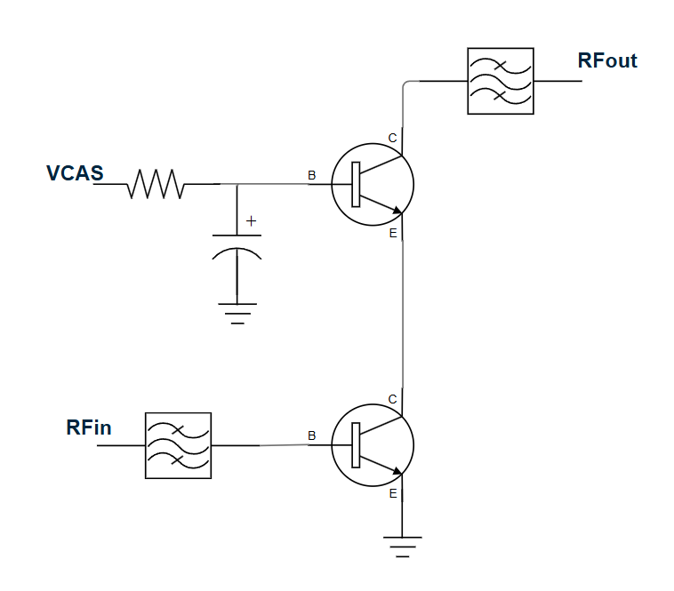
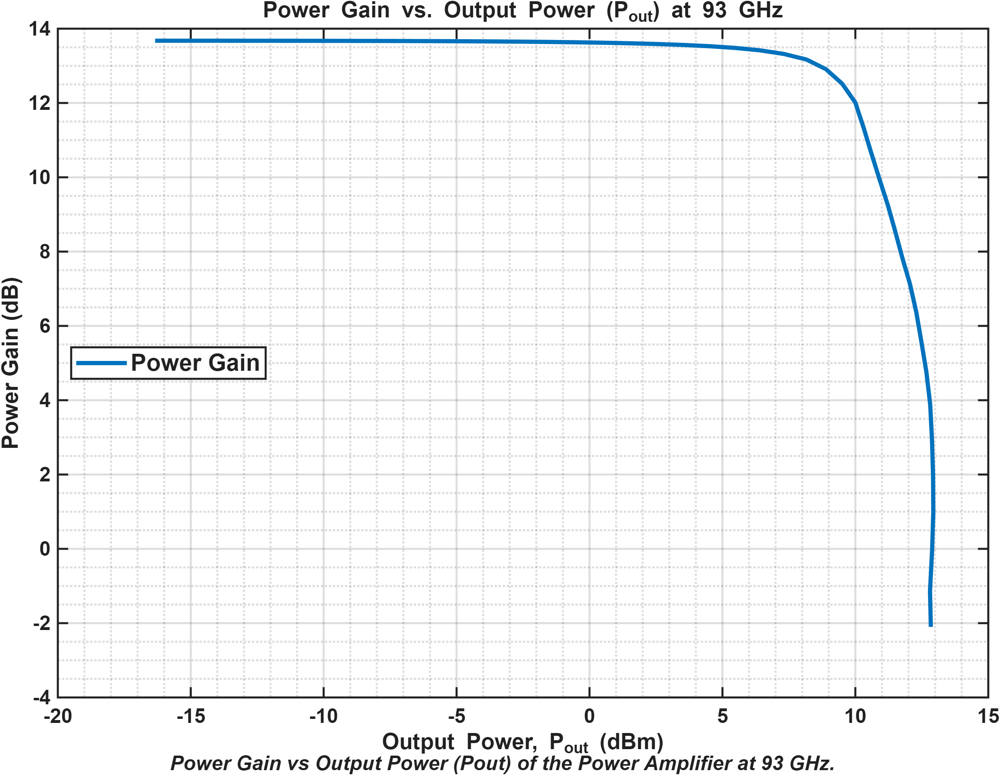
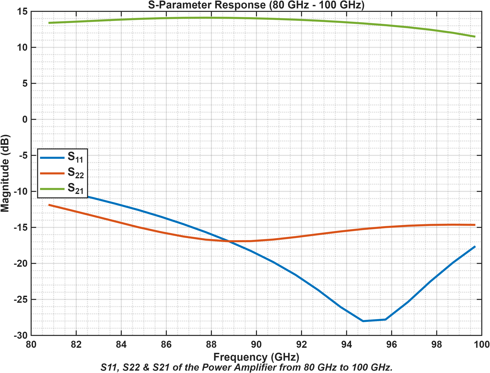
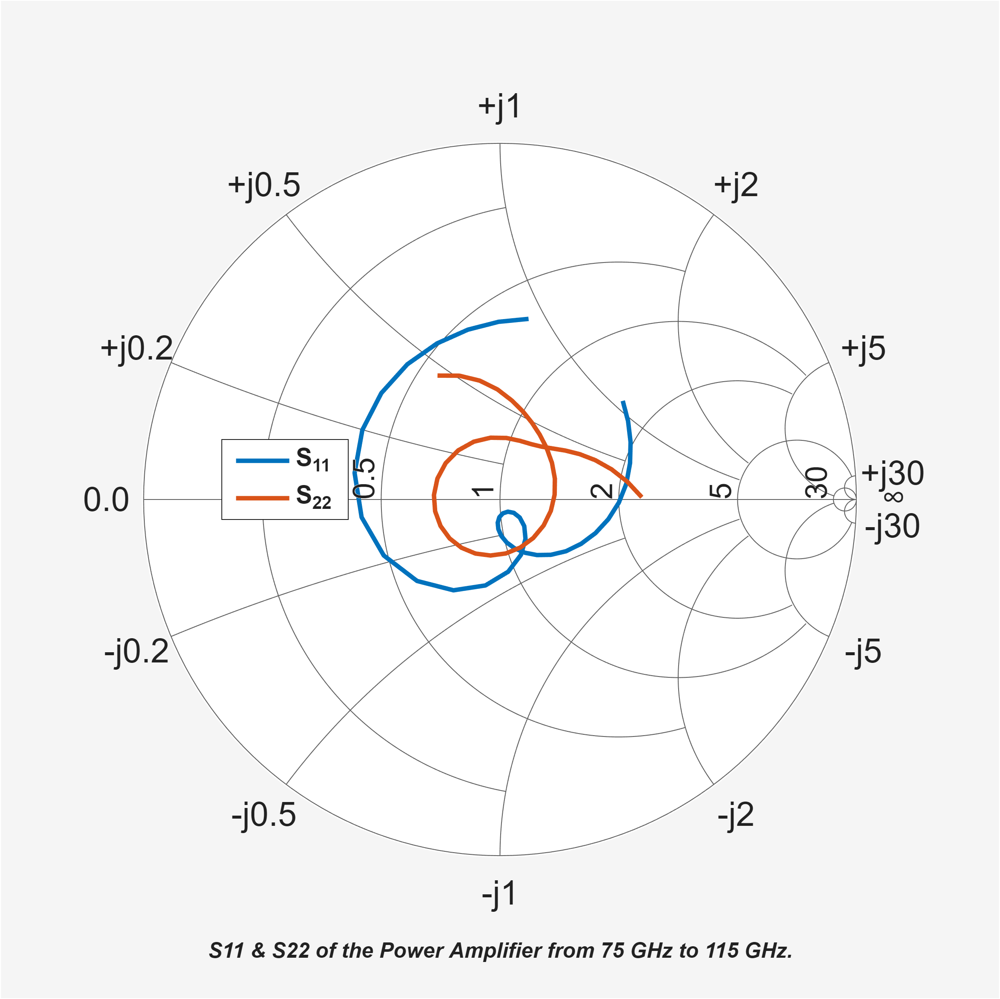

# W-Band Power Amplifier (PA-IC)

## Specifications

| Parameter | Value |
|---|---:|
| Frequency Bandwidth | **80–100 GHz** |
| Topology | **Cascode** |
| Small-Signal Power Gain | **~13.4 dB** |
| P1dB @ 93 GHz | **~9 dBm** |
| Psat | **~13.5 dBm** |
| VDD | **4 V** |
| DC Collector Current | **12 mA** |
| Maximum PAE | **15 %** |
| Layout Area | **1.2 mm²** |

## Circuit

## Power Gain

## S-Parameters

## Smith Chart

